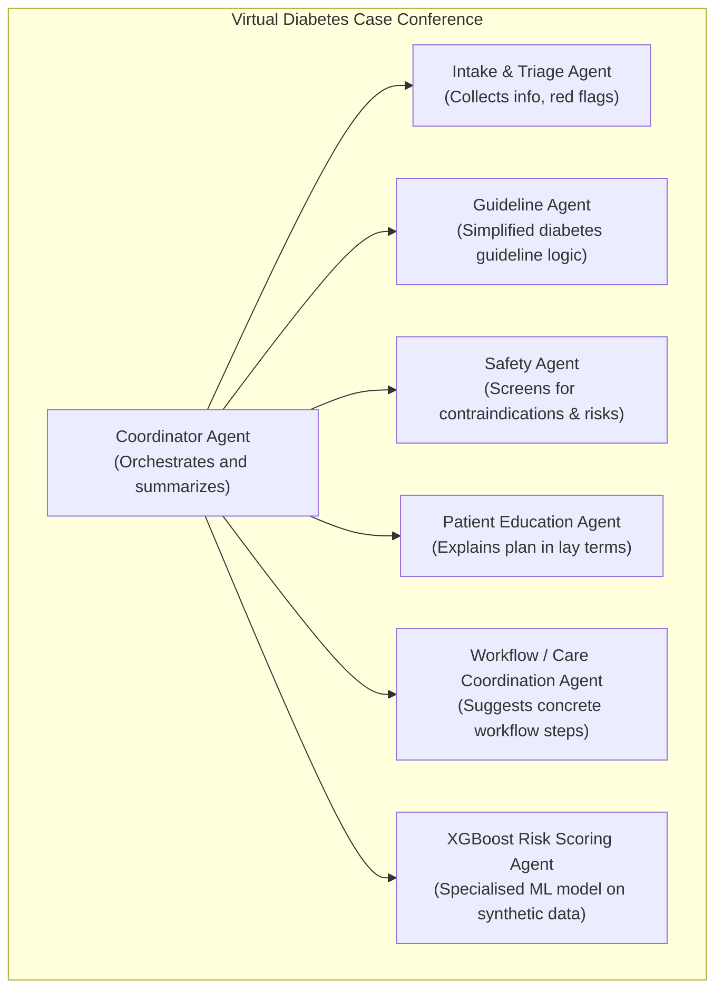
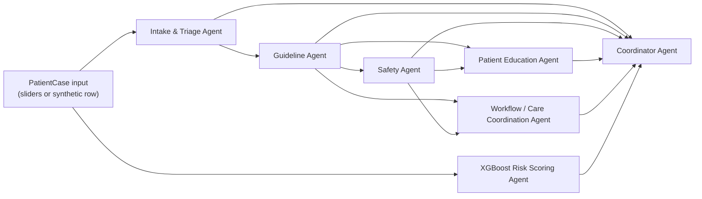
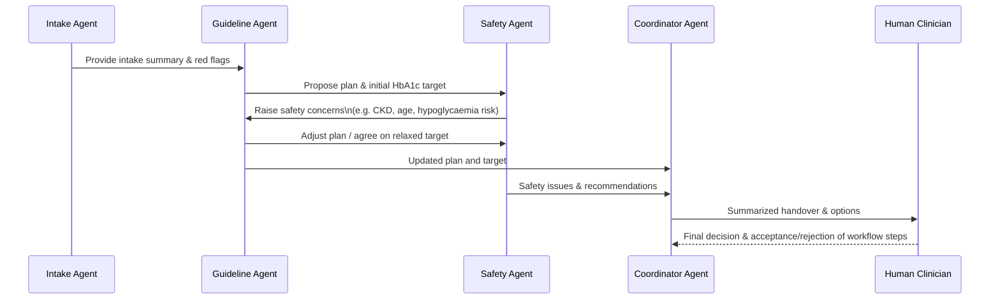

# Multi-Agent Diabetes Demo – Agent Hierarchies (Mermaid)

This file contains Mermaid diagrams describing the agents and hierarchies used in the Streamlit multi-agent diabetes case conference demo.

You can render these diagrams in any Markdown viewer that supports Mermaid (e.g. GitHub, VS Code with a Mermaid/Markdown extension, or online Mermaid live editors).

---

## 1. Agent hierarchy (role-based)

---

## 2. Main data flow for a single case

---

## 3. Example conversation & human-in-the-loop focus

This diagram focuses on the *Guideline vs Safety* negotiation plus the clinician.

